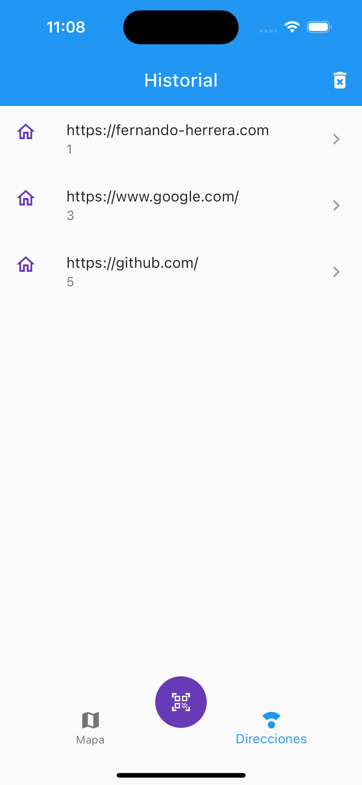

# QR Scanner Flutter

QR Scanner is a Flutter application that allows users to scan QR codes using their mobile devices.

## Features

- Scan QR codes using the device's camera
- Store scanned QR codes in SQLite database
- Open URLs from scanned QR codes
- Save scanned QR codes for future reference, displaying them in a list across the app
- Use Provider as a state management solution

## State Management

This project utilizes the Provider package as the state management solution. The Provider package allows for efficient and easy management of application state. Learn more about Provider here: [Provider Package](https://pub.dev/packages/provider)

## Database

The project uses the SQLite database for storing and retrieving scanned QR codes. SQLite is a lightweight and reliable database solution for Flutter applications. Learn more about SQLite here: [SQLite Flutter Package](https://pub.dev/packages/sqflite)

## Usage

1. Launch the application on your mobile device or emulator.
2. Grant camera permissions to the application.
3. Point the camera towards a QR code to start scanning.
4. The application will display the content of the scanned QR code.
5. Scanned QR codes are stored in the SQLite database for future reference.

## Screenshots

### Main Screen

The main screen of the application displays a list of scanned URLs and geo localizations. Each entry in the list is differentiated based on whether it represents a HTTP URL or a geo localization.

- HTTP URLs are shown with a website icon and the full URL is displayed.
- Geo localizations are indicated with a map icon and the latitude and longitude coordinates are presented.

Users have the option to delete all entries by tapping the delete icon located at the top of the screen. Additionally, each entry can be individually deleted by swiping it to the left or right.

This intuitive interface allows users to easily manage their scanned URLs and geo localizations.
